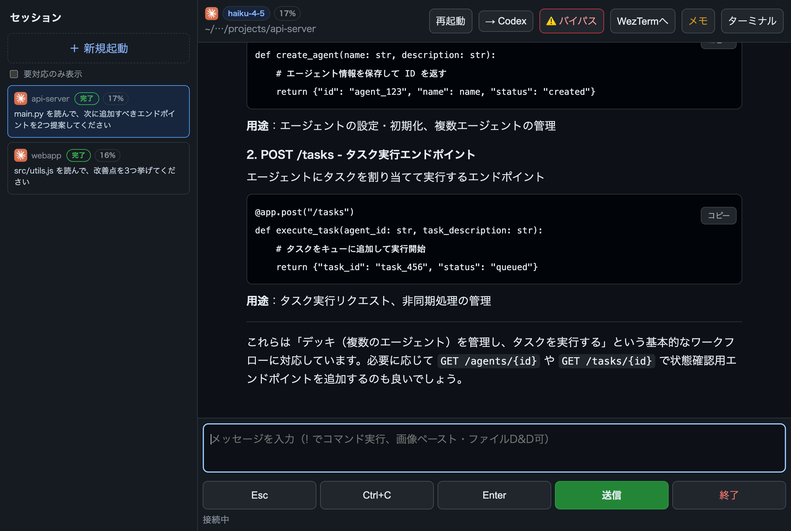
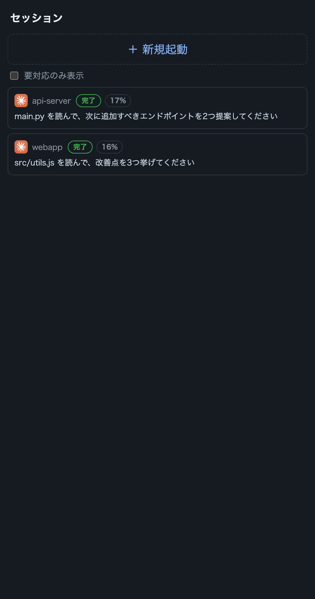
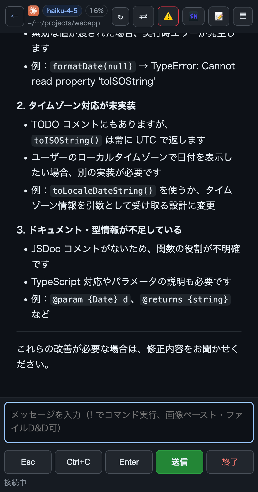
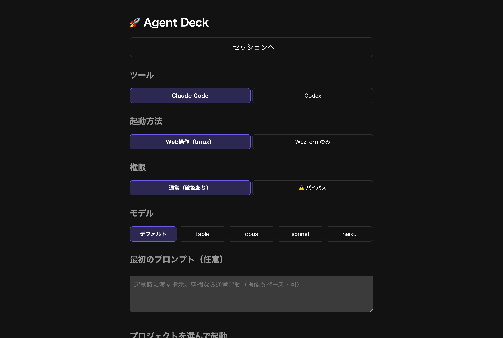

# Agent Deck

AI コーディング CLI（Claude Code / Codex）を Mac の tmux 上で起動し、
スマホや別 PC のブラウザから監視・操作する Web ランチャー & セッションマネージャです。

> Agent Deck is a web launcher & session manager for AI coding CLIs
> (Claude Code / Codex) running in tmux on macOS.
> Launch sessions from your phone, watch progress, send messages, and
> hand conversations off between CLIs. The UI is currently Japanese-only.



| スマホ: セッション一覧 | スマホ: セッション操作 |
|:---:|:---:|
|  |  |

## できること

- **ワンタップ起動**: プロジェクトのボタンを押すと tmux セッションで CLI が起動する
- **スマホから操作**: 端末出力のリアルタイム表示、メッセージ送信、AI回答の引用、Enter / Esc / Ctrl+C、画像・ファイル添付
- **sandbox 外でコマンド実行**: shell コードブロックから新しいWebシェルを開いて実行
- **セッション一覧**: 実行中/待機中の判定、会話の最初のプロンプト表示、コンテキスト使用率、作成した PR/issue のチップ表示
- **GitHub レビュー**: 自分へのレビュー依頼または指定したPRから、Diffを開いたAIセッションを開始
- **会話の再開**: 最近の会話を `--resume` 付きでワンタップ再起動。モデル切り替えも resume 方式で安全に行う
- **Claude ⇔ Codex の引き継ぎ**: 会話履歴を引き継ぎ資料として保存し、同じ作業ディレクトリで反対側の CLI に交代させる
- **ブックマークレット**: 閲覧中のページ（GitHub issue 等）をプロンプトにプリフィルして起動
- **Chatwork 受信箱**（任意）: メンションを一覧し、そのままプロンプトにセットして起動

起動ページではツール・起動方法・権限・モデル・最初のプロンプトを選んで
ワンタップでセッションを開始できます。



## 動作要件

- macOS
- tmux
- Python 3.12 以上（標準ライブラリのみ。追加パッケージ不要）
- [Claude Code](https://claude.com/claude-code) および/または Codex CLI
- PR/issue チップ表示を使う場合は `gh` CLI

## インストール

```sh
git clone https://github.com/YOUR_NAME/agent-deck.git
cd agent-deck

# CLI ランチャーを PATH に置く
ln -s "$PWD/deck" ~/.local/bin/deck

# 設定ファイル（任意。無くても既定値で動く）
mkdir -p ~/.config/agent-deck
cp config.example.json ~/.config/agent-deck/config.json
# → project_bases / pinned を自分のプロジェクトに書き換える

# ツールアイコン（任意）: 公式配布元から取得する。無ければテキスト表示
./icons/fetch.sh

# Web UI を launchd で常駐させる
mkdir -p ~/.local/share/agent-deck
sed -e "s|__REPO_DIR__|$PWD|g" -e "s|__HOME__|$HOME|g" \
    -e "s|__PYTHON__|$(command -v python3)|g" \
    launchd/com.agent-deck.web.plist.template \
    > ~/Library/LaunchAgents/com.agent-deck.web.plist
launchctl bootstrap gui/$(id -u) ~/Library/LaunchAgents/com.agent-deck.web.plist
```

`http://<Mac の Tailscale IP>:8787` にアクセスすると起動ページが開きます。

画面下部には現在のバージョンが表示されます。GitHub Releases に新しいバージョンが
ある場合は更新ボタンが現れ、作業ツリーにローカル変更がなければ対象Releaseへ
fast-forwardして自動再起動します。

FileVault が有効な場合は再起動後に一度 Mac 本体でログインが必要です。

## ⚠️ セキュリティ上の注意

**Agent Deck に認証はありません。** アクセス元 IP による制限のみで、
既定では Tailscale 網内（100.64.0.0/10）と localhost だけを許可します。

- Web UI に到達できる人は、**あなたの Mac 上で任意のコマンドを実行できるのと同等**の権限を持ちます（任意ディレクトリで CLI を起動し、任意のテキストを送信できるため）
- `allowed_networks` を信頼できる端末しかいないネットワークより広げないでください
- 公共の LAN やインターネットへの直接公開は絶対にしないでください
- ポート転送やリバースプロキシで公開する場合は、必ず前段に認証を置いてください

## 既知の制約

- **内部仕様への依存**: Claude Code の会話ログ（JSONL）、選択肢画面の tmux パース、Codex の rollout ファイル等、CLI の非公開仕様に依存しています。CLI のアップデートで表示が壊れることがあります
- **API 課金**: セッション一覧の「要対応/他者待ち/完了」分類は `claude -p` を呼び出すため、少量の API / サブスクリプション利用が発生します。既定は Haiku で、`wait_classifier_model` により Sonnet などへ変更できます
- **UI は日本語のみ**です

## 使い方

### 権限バイパス起動

`/new` の「権限」で「⚠️ バイパス」を選ぶと、確認プロンプトを省いて起動します。

| ツール | フラグ | 効果 |
|--------|--------|------|
| Claude Code | `--dangerously-skip-permissions` | 権限確認をスキップ |
| Codex | `-a never -s workspace-write` | 確認なし・書き込みはワークスペース内に限定 |

バイパスで起動したセッションは一覧に `bypass` バッジが付き、Web UI からの
restart（resume）でも同じ権限モードを引き継ぎます。
ショートカット用の直接起動 URL では `bypass=1` を付けます。

```
/launch?dir=<パス>&go=1&model=<m>&bypass=1
```

### CLI ランチャー（deck）

```sh
deck <ディレクトリ> [CLIへの追加引数...]
deck ~/projects/my-app --model haiku
TAB_BIN=codex deck ~/projects/my-app
```

CLI は tmux セッション内で動くため、ssh が切れてもセッションは生き続けます。

環境変数:

| 変数 | 効果 |
|------|------|
| `TAB_BIN=<コマンド>` | 起動する CLI を差し替える（既定は claude） |
| `CLAUDE_TAB_EPHEMERAL=1` | CLI の終了と同時に tmux セッションごと破棄する（自動実行ジョブ向け） |
| `CLAUDE_TAB_LABEL=<名前>` | セッションに識別札を付け、起動時に同じ札の古いセッションを片付ける |

起動したセッションには `CLAUDE_TAB_SESSION`（別名 `DECK_SESSION`）が渡されるので、
CLI 自身が `tmux kill-session -t "$CLAUDE_TAB_SESSION"` で自分を終了できます。

### Web からセッションを操作する

Web UI から起動した tmux セッションは、セッション一覧から開くと端末出力のリアルタイム
表示・メッセージ送信・Enter / Esc / Ctrl+C・セッション終了ができます。
AI の回答内でテキストをドラッグ選択すると「選択部分を引用」がポップアップします。
押すと、その部分を引用形式で入力欄へ追加できます。
過去のメッセージを読んでいる間は新着が届いてもスクロール位置を維持し、最下部へ
戻すと新着への自動追従を再開します。

会話内の `sh` / `bash` / `zsh` コードブロックにある「シェルで実行」を押すと、
確認後に同じ作業ディレクトリで新しい tmux セッションを開き、コマンドを実行します。
コマンドは AI CLI を経由しないため Codex の sandbox 対象外です。実行後は
そのWebシェルへ移動し、出力を確認できます。

### Claude ⇔ Codex の引き継ぎ

セッション画面の「→ Codex」「→ Claude」から、会話履歴をローカルの引き継ぎ資料へ
保存し、同じ作業ディレクトリのまま反対側の CLI へ切り替えられます。

### ブックマークレット

`/new` ページ下部の「📎 Agent Deckに送る」リンクをブックマークバーへ
**ドラッグ**して登録します（サーバーの URL が焼き込まれた版が配信されます）。
閲覧中ページの URL・タイトル・選択テキストをプロンプト欄にプリフィルした
状態でランチャーが開きます。アドレスバーへの貼り付けは Chrome が
`javascript:` を削るため使えません。iOS Safari は適当なページをブックマーク
した後、編集で URL を `bookmarklet.js` の内容に差し替えると動作します。

## 設定

`~/.config/agent-deck/config.json`（`AGENT_DECK_CONFIG` 環境変数で変更可）。
全項目とコメントは [config.example.json](config.example.json) を参照してください。

PR差分モードの初期表示は `pr_diff_open` で選べます。`never`（既定）は常に閉じ、
`auto` はPRが見つかった場合だけ開き、`always` は常に開いて開始します。
差分モードでも画面下部の入力欄から、そのままセッションへ指示を送信できます。
起動ページの「GitHub レビュー」から開始したセッションでは、この設定にかかわらず
対象PRを紐づけて差分モードを最初から開きます。レビュー依頼とPR URLの対象リポジトリは、
`pinned`、`project_bases`、`extra_projects` に登録されたプロジェクトの `origin` remoteから特定します。

ポートは優先順に `--port` フラグ > `AGENT_DECK_PORT` 環境変数 > 設定ファイルの
`port` > 既定値 8787 で決まります。設定ファイルを分ければ同じマシンで
複数インスタンスを動かせます（例: `AGENT_DECK_CONFIG=demo.json python3 server.py --port 8788`）。

実行時のデータ（アップロード画像・キャッシュ・ログ）は
`~/.local/share/agent-deck/` に保存されます（`data_dir` で変更可）。

## 開発

新規起動ページのフロントエンドは、役割ごとに次のファイルへ分けています。

- `templates/new.html`: HTML構造とPythonから差し込むプレースホルダー
- `static/new.css`: レイアウトとレスポンシブ表示
- `static/new.js`: タブ切り替え、フォーム、GitHubレビュー・Chatwork連携

```sh
ruff check server.py
python3 -m unittest test_server
node --check static/new.js
```

### リリース

`VERSION` を更新して変更をmainへcommitした後、次のスクリプトを実行します。
lint・test・ブランチ・作業ツリーを検証してから、タグとGitHub Releaseを公開します。

```sh
scripts/release.sh 0.1.0
```

## ライセンス

[MIT](LICENSE)
